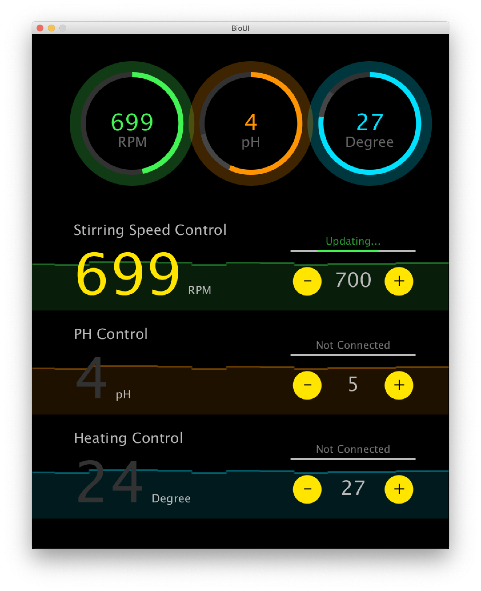
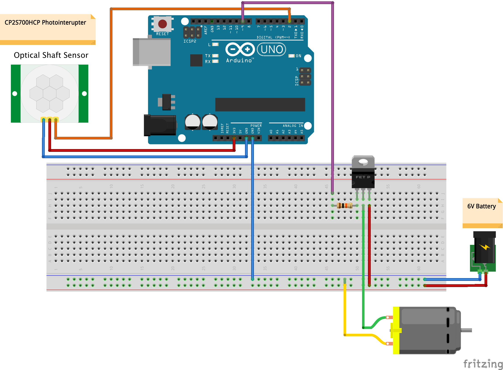
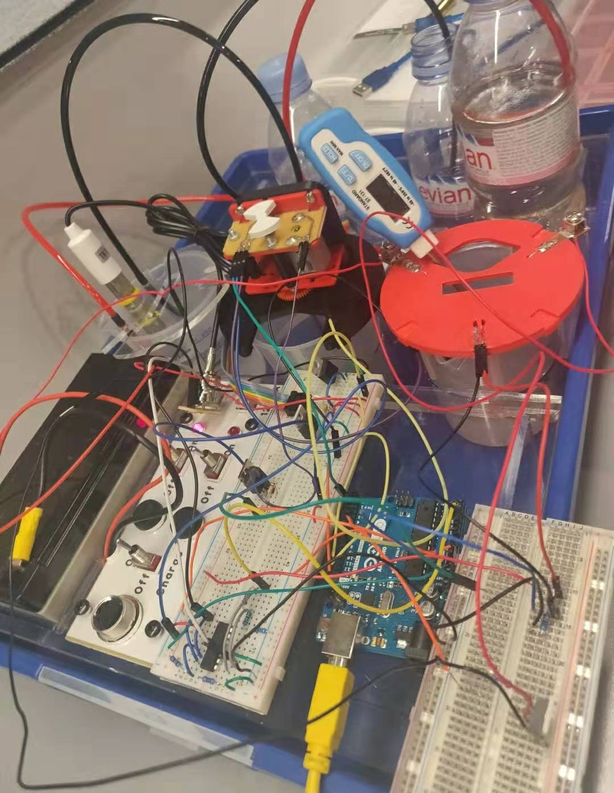

# ENGF0001-Bioreactor-Display
ENGF0001 Global Health Project Display Code

# Overview
This is the client control panel displayed on the PC, connected to the Arduino bioreactor system. The system is consist of stirring, heating, and ph control subsystems. The control panel (display) is able to display the real-time value from each subsystem, and each value can be manually adjusted. This is done by the serial communication port.

# User Interface
The user interface aims to provide an easy and intuitive way for the user to monitor the subsystems and adjust the setpoints to optimize the growth conditions for the Bioreactor. The user interface must fulfil the following requirements:
• Intuitive
• Ability to observe real-time data from the subsystems
• Ability to change setpoints for each subsystem
• Validate user input for the setpoints to be within valid ranges
• Ability to communicate with the Arduino firmware
The User Interface (“UI”) was developed with Processing.

The three subsystems are represented in the respective dials and graphs. The data for the graphs and dials are received in real-time from the Arduino. The user is able to change the setpoint by either using the “-” and “+” buttons for each subsystem, or he/she can choose to enter the setpoint via keyboard. Invalid values which fall outside of acceptable ranges are rejected.

# System Info

